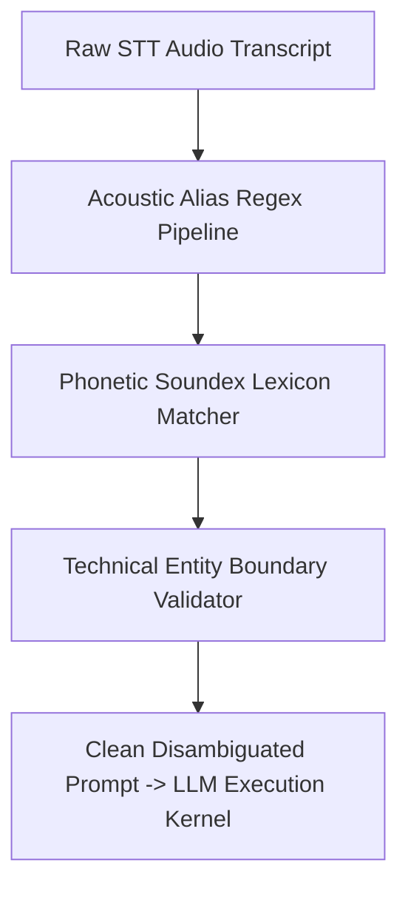

# GenPark AI Agent Skill - Phonetic Homophone STT Disambiguator

Acoustic homophone disambiguator and Soundex phonetic corrector restoring domain-specific terminology corrupted during speech-to-text transcription.

Verified by [GenPark AI](https://genpark.ai) and compatible with [Model Context Protocol (MCP)](https://genpark.ai/mcp).

## Architecture Diagram

## Features
- **Soundex & Metaphone Mapping**: Captures phonetic similarities independent of acoustic spelling artifacts.
- **Domain Lexicon Anchoring**: Prevents hallucinated replacements of everyday words while protecting enterprise terms.
- **Zero External Dependencies**: 100% Python standard library.
